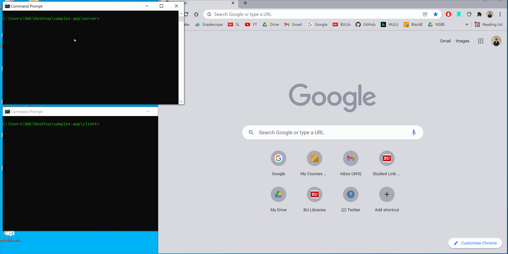

# App that lets you play the samples of any song on Spotify

### Tech Stack: Express, React, and Node
APIs: Spotify and Genuis
Backend is hosted on Heroku and Frontend is to be hosted on GitHub Pages

## Demo of the app:
Anytime you listen to a song on Spotify and you want to see its samples, click the "See Samples Below" button. You will be met with the songs that are sampled into the song, or were sampled by another song, or were interpolations/remix/cover of another song. You get the option to click and play those samples on the app allowing you to experience new music and enjoy the engineering behind the music you listen to. 

## To get the app running:

1. make sure you have node.js installed (https://nodejs.org/en/)
2. git clone the Samples repo https://github.com/bmulaw/samples (will require environment variables - contact me for that)
3. cd into client folder and run `npm install` in terminal to install all dependencies.
4. in the same client folder, run `npm start`

Will require having a Spotify account. 

The app will ask you to sign in to Spotify and you can then search a song you want to listen to. Once you play that song, click on "Show Samples Below" button and the samples should show up on the page and you can then play them. You can click the same button "Hide Samples" to not display the Samples.

## Credits for tips and advice:
1. Bjoern Hasemann (Engineer)
2. Della Lin (Engineer)
3. Gagan Kang (Engineer)
4. Web Dev Simplified (Engineer/YouTuber)
